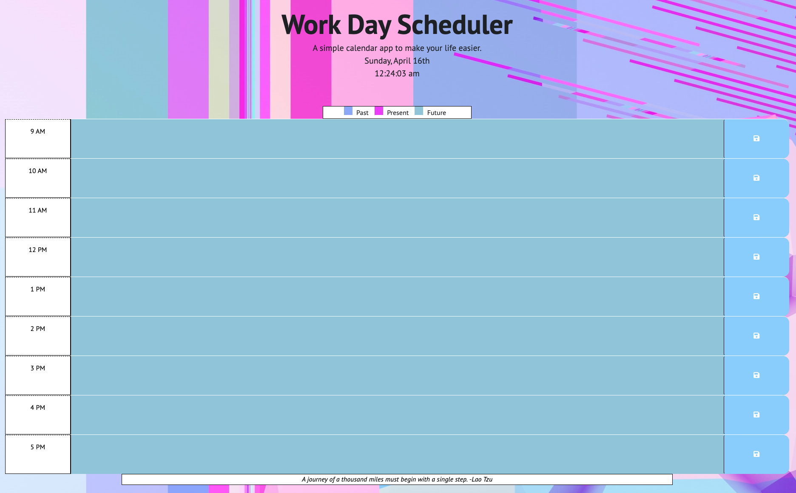

# Work-Day-Scheduler
A calendar application that allows a user to store data for each hour of the day.

## Description

This webpage highlights a simple, work day scheduler application from 9 AM - 5 PM that allows the user to store data for each hour of the day and save their information to local storage after clicking the Save icon. After the user clicks the Save button for their chosen time block, the user is presented with an alert box notifiying them that their changes have been saved. When the page refreshes, the save data remains until it is deleted by the user.

This calendar also includes the ability to display the current date and time, based on the user's location. Additional HTML has been added to show a color key to the user for past, present, and future events. For added inspiration to help you through the work day, additional JavaScript code has been added into the footer to display a random quote generator of pre-stored, inspirational quotes. A background image has been added and the CSS has been modified to match the background image colors.

[Deployed App](https://chadkraus87.github.io/Work-Day-Scheduler)

## Installation

No installation necessary for this application. If you would like to use this code, you may clone down the repo.

## Usage

In order to assist the user with scheduling their work day and keeping track of events or appointments, this web application offers blocks of time to schedule and save information locally. If the user navigates away from the page, their information is stored until the user chooses to delete the data. For accessibility purposes, a color key has been added to show past, present, and future time slots.

## Credits

[Day.JS](https://day.js.org/)

[Introduction to Web APIs](https://developer.mozilla.org/en-US/docs/Learn/JavaScript/Client-side_web_APIs/Introduction)

[Web API - Storage](https://developer.mozilla.org/en-US/docs/Learn/JavaScript/Client-side_web_APIs/Introduction)

[Introduction to Bootstrap](https://getbootstrap.com/docs/4.1/getting-started/introduction/)

[jQuery API](https://api.jquery.com/)

[Professional README Guide](https://coding-boot-camp.github.io/full-stack/github/professional-readme-guide)

[Unsplash](https://unsplash.com/photos/LOaS_VCq1og)

[Good Reads Quotes](https://www.goodreads.com/quotes)

[Scary Mommy Drag Race Quotes](https://www.scarymommy.com/drag-race-quotes)

[Font Awesome](https://fontawesome.com/)

## License

MIT License

A short and simple permissive license with conditions only requiring preservation of copyright and license notices. Licensed works, modifications, and larger works may be distributed under different terms and without source code.

## Contact Me

Email: chad@kraus-fit.com
Phone: 512-650-7633
[LinkedIn](https://www.linkedin.com/in/chadwick-kraus/)